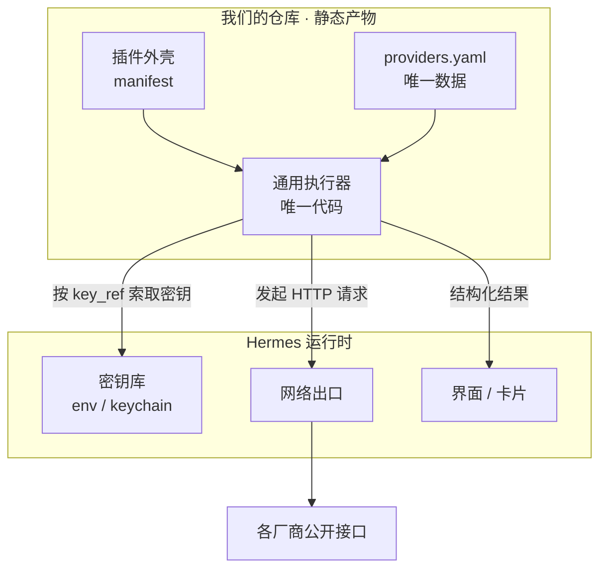
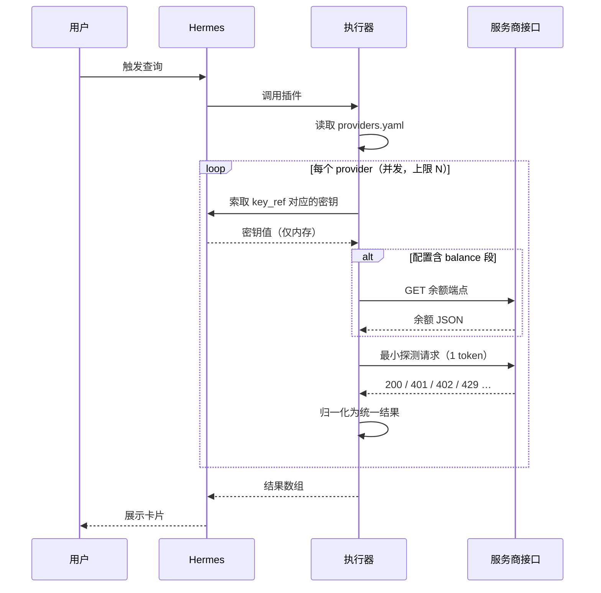
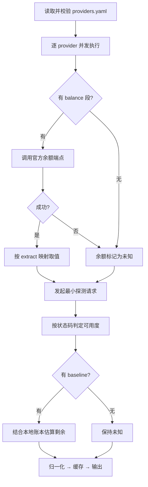

# hermes-keywatch 设计文档

> 在 Hermes 中查看已配置大模型 API Key 的**余额**与**可用度**。

| 项目 | 内容 |
|---|---|
| 文档版本 | v1.0（草案） |
| 日期 | 2026-09-11 |
| 状态 | 设计阶段，**尚未开始实现** |
| 仓库名 | `hermes-keywatch` |
| 命名备选 | `keygauge`、`talaria`、`hermes-purse`、`keyledger`（已排除 `caduceus`，与医疗符号冲突） |
| 当前用户 | 单人自用 |

---

## 1. 背景与目标

### 1.1 问题

开发者在 Hermes 中往往同时配置了多家大模型服务商的 API Key（DeepSeek、Kimi、OpenRouter、OpenAI、Anthropic……）。真正的问题不是"没钱了"，而是**发现得太晚**：

- 任务跑到一半才失败，前面轮次已经计费，结果却没拿到；
- 报错表现为超时或鉴权失败，无法从单次错误里判断是"欠费"还是"限流"还是"网络问题"；
- 账号分散，没人会天天登录各家控制台。

本质是：**余额是可观测的，但缺少提前、批量、统一口径的观测手段。**

### 1.2 目标

1. 一次性查看 Hermes 中**所有**已配置 Key 的余额与可用状态，口径统一。
2. **新增一家服务商只改配置，不改代码。**
3. 仓库内**不含任何密钥**，密钥始终留在 Hermes 自己的存储中。
4. 拿不到精确余额时，**诚实降级**并标注数据可信度，绝不编造数字。
5. 查询过程**只读、低成本**，不消耗可观的额度。

### 1.3 非目标（明确不做）

| 不做 | 原因 |
|---|---|
| 不托管、不代填、不推导 API Key | 密钥归属 Hermes，插件只做读者 |
| 不做请求代理 / 网关 / 负载均衡 | 那是另一类产品，与观测无关 |
| 不做计费与账单对账 | 厂商接口给什么就展示什么 |
| 不做汇率换算 | 不同币种不换算，避免给出误导性的合并数字 |
| 不做额度自动充值 | 涉及资金操作，越权 |
| 不抓取网页 / 解析 HTML | 脆弱、易失效、违反服务条款风险 |

---

## 2. 术语表

| 术语 | 含义 |
|---|---|
| **provider** | 一家大模型服务商，如 DeepSeek、Moonshot |
| **注册表（registry）** | `providers.yaml`，声明"该问谁、怎么问、怎么解读答案"的数据文件 |
| **执行器（executor）** | 唯一的通用代码，读取注册表并完成查询，不认识任何具体厂商 |
| **key_ref** | 对密钥的**引用**（如 `env:DEEPSEEK_API_KEY`），不是密钥值 |
| **余额（balance）** | 账户剩余金额，只有少数厂商提供公开接口 |
| **可用度（availability）** | 该 Key 当前能否成功调用，**所有厂商都可探测** |
| **降级链** | A 官方余额 → B 可用性探测 → C 本地账本 / 手动基线 |
| **baseline** | 用户手工登记的一次充值基线（金额 + 时间），用于倒推估算剩余 |
| **probe** | 一次最小成本的真实调用，用于判定可用度 |

---

## 3. 关键设计决策

### ADR-1：采用「声明式注册表 + 单一通用执行器」

**决策**：服务商知识全部落在 `providers.yaml`（数据），执行器只有一份（代码）。

**被否决方案一：每家服务商一个固定脚本。**
必然有漏掉的服务商，且每新增一家都要改代码、重测、重新发版。把"服务商知识"硬编码进代码，是这个方案的根本缺陷——**不是脚本本身的问题，是耦合方式的问题。**

**被否决方案二：每次运行时由模型即兴决定调哪个接口、读哪个字段。**
不可复现（同样的输入可能得到不同的查询路径）、不可测试、延迟高，且一次网络抖动或模型幻觉就会污染读数。

**结论**：注册表是数据，执行器是代码，两者分离。新增服务商 = 加一段 YAML，零代码改动。

---

### ADR-2：密钥只引用，不存储

**决策**：注册表中只写 `key_ref: env:DEEPSEEK_API_KEY` 这样的引用；执行器在运行时向 Hermes 索取密钥值，用后即弃。

**理由**：密钥一旦进入插件仓库或插件配置，就多了一份需要轮换、审计、保护的副本。密钥的归属方应当只有 Hermes 一处。这条同时解决了"用脚本是不是必须把 key 存进去"的顾虑——**不需要，也不允许。**

**执行细则**：密钥值不得出现在日志、错误信息、缓存文件、测试快照中（见 §9）。

---

### ADR-3：余额与可用度分离，采用三级降级链

**决策**：把两个指标当作独立概念处理，取不到前者就退到后者，并**明确标注数据来源与可信度**。

**理由**：这是本项目最重要的现实约束——**有公开余额接口的服务商是少数。**

| 层级 | 手段 | 覆盖度 | 精度 |
|---|---|---|---|
| **A** | 官方余额端点 | 有限 | 精确 |
| **B** | 最小可用性探测 | 100% | 仅"可用/不可用/受限" |
| **C** | 本地账本 / 手动基线 | 100% | 估算 |

配置中 `balance` 段缺失时**自动**降级到 B，不需要任何 if-else 分支。

**禁止事项**：当 A 层失败时，不得用 B 层结果反推一个"余额数字"。余额字段只能是「精确值」或「未知/估算」，且必须带 `source` 标记。

---

### ADR-4：配置生成采用三段式，而非全自动

**决策**：`agent 起草 → 人工确认 → 固化进注册表`。

遇到注册表中没有的服务商时，让 Hermes 查该厂商官方文档、生成一段 YAML 草稿供人工过目，确认后写入 `providers.yaml`。此后每次执行都是**确定性**的。

**理由**：既解决了"会漏"（补草稿的边际成本几乎为零），又避免了"每次运行都不可复现"。**注意：agent 写的是配置草稿，不是运行时的决策逻辑**——运行路径必须完全确定。

全自动联网现查可作为**可选模式**保留，但不得作为默认行为。

---

## 4. 系统架构

### 4.1 职责边界

系统的核心是**一条清晰的交接面**：



| 事项 | 归属 |
|---|---|
| 插件外壳（manifest、入口声明） | **我们**（形式待 Hermes 规范确认） |
| 通用执行器 | **我们** |
| `providers.yaml` 注册表 | **我们** |
| 字段规范与文档 | **我们** |
| 持有并交付密钥 | Hermes |
| 提供网络出口 | Hermes |
| 渲染界面 / 承载定时任务 | Hermes |
| 决定何时调用插件 | Hermes |

**一句话**：我们负责"知道该问谁、怎么问、怎么解读答案"；Hermes 负责"有密钥、能联网、有地方显示"。**密钥不流经交接面。**

### 4.2 运行时序



---

## 5. 仓库结构

```
hermes-keywatch/
├── manifest.*              # 插件外壳：声明插件元信息与入口（格式待确认）
├── src/
│   ├── executor.*          # 通用执行器：唯一的业务代码
│   ├── registry.*          # 注册表加载 + schema 校验
│   ├── probe.*             # 可用性探测与状态判定
│   └── normalize.*         # 结果归一化
├── providers.yaml          # 注册表：唯一的数据来源
├── schema/
│   ├── provider.schema.json    # providers.yaml 的结构约束
│   └── result.schema.json      # 输出的结构约束
├── tests/
│   ├── fixtures/           # 各厂商真实响应的脱敏样本
│   └── *.test.*
├── docs/
│   └── DESIGN.md           # 本文档
├── CONTRIBUTING.md         # 如何新增一家服务商（面向 agent 与人类）
└── README.md
```

**`CONTRIBUTING.md` 是本方案的关键一环**：它把"如何新增一家服务商"写成可执行的步骤，让 agent 和人遵循同一份流程。

---

## 6. 数据契约 A：`providers.yaml`

### 6.1 字段定义

| 字段 | 必填 | 类型 | 说明 |
|---|---|---|---|
| `id` | 是 | string | 唯一标识，小写短横线，用作输出主键 |
| `display` | 是 | string | 展示名称 |
| `key_ref` | 是 | string | 密钥引用，格式见 §6.3 |
| `base_url` | 否 | string | 默认接口根地址，供相对路径拼接 |
| `balance` | 否 | object | 余额查询段；**缺失即自动降级为纯探测** |
| `balance.method` | 否 | string | 默认 `GET` |
| `balance.path` | 是 | string | 相对 `base_url` 或绝对 URL |
| `balance.auth` | 否 | string | 默认 `bearer`；可选 `x-api-key`、`none` |
| `balance.headers` | 否 | object | 额外请求头（不含密钥） |
| `balance.extract` | 是 | object | 字段映射，见 §6.2 |
| `balance.currency` | 否 | string | 固定币种（响应中不带币种时使用） |
| `probe` | 否 | object | 探测段；缺失则使用全局默认探测参数 |
| `probe.path` | 是 | string | 探测端点 |
| `probe.body` | 是 | object | 探测请求体（应为最小成本） |
| `probe.expect` | 否 | integer | 期望状态码，默认 200 |
| `baseline` | 否 | object | 手动基线，供 C 层估算 |
| `baseline.amount` | 是 | string | 充值金额，字符串保存精度 |
| `baseline.currency` | 是 | string | 币种 |
| `baseline.at` | 是 | string | 充值时间，ISO 8601 |
| `enabled` | 否 | boolean | 默认 `true`，用于临时停用 |
| `notes` | 否 | string | 备注，例如接口的非官方性说明 |

### 6.2 字段映射语法

`extract` 的每个值是一个 **JSONPath 表达式**，从响应中取字段：

```yaml
extract:
  remain:  $.balance_infos[0].total_balance
  granted: $.balance_infos[0].granted_balance
  currency: $.balance_infos[0].currency
```

约定：

- 取不到时该字段为 `null`，**不抛异常**；
- 值为数字或数字字符串时，统一**转成字符串保留原始精度**，避免浮点误差；
- `remain` 是唯一有特殊含义的键，其余键作为附加明细透传。

### 6.3 `key_ref` 语法

| 形式 | 含义 |
|---|---|
| `env:NAME` | 读取环境变量 `NAME` |
| `secret:NAME` | 通过 Hermes 提供的密钥接口读取名为 `NAME` 的条目 |
| `none` | 该接口无需鉴权（极少数） |

**禁止**在 `key_ref` 中写入字面量密钥值。校验器遇到形如 `sk-`、`Bearer ` 的值应直接拒绝加载并报错。

### 6.4 完整示例

```yaml
version: 1

providers:
  # A 层：有官方余额接口
  - id: deepseek
    display: DeepSeek
    key_ref: env:DEEPSEEK_API_KEY
    base_url: https://api.deepseek.com
    balance:
      path: /user/balance
      auth: bearer
      extract:
        remain:   $.balance_infos[0].total_balance
        granted:  $.balance_infos[0].granted_balance
        topped:   $.balance_infos[0].topped_up_balance
        currency: $.balance_infos[0].currency
    probe:
      path: /chat/completions
      body:
        model: deepseek-chat
        max_tokens: 1
        messages: [{ role: user, content: "." }]

  # A 层：余额接口返回的是 Key 级限额
  - id: openrouter
    display: OpenRouter
    key_ref: env:OPENROUTER_API_KEY
    base_url: https://openrouter.ai/api/v1
    balance:
      path: /key
      auth: bearer
      extract:
        remain:   $.data.limit_remaining
        used:     $.data.usage
        limit:    $.data.limit
        currency: "USD"          # 响应不含币种，固定为 USD
    notes: 余额为 Key 级限额，非账户总余额

  # C 层：无余额接口，仅有手动基线
  - id: anthropic
    display: Anthropic
    key_ref: env:ANTHROPIC_API_KEY
    base_url: https://api.anthropic.com
    probe:
      path: /v1/messages
      headers: { anthropic-version: "2023-06-01" }
      body:
        model: claude-haiku-4-5
        max_tokens: 1
        messages: [{ role: user, content: "." }]
    baseline:
      amount: "50.00"
      currency: USD
      at: 2026-09-01T00:00:00+08:00
    notes: 无公开余额接口，剩余额度为基于基线的估算

  # 纯探测：连 probe 段都可省，使用全局默认
  - id: openai
    display: OpenAI
    key_ref: env:OPENAI_API_KEY
    base_url: https://api.openai.com
    notes: 余额接口现状待实测确认
```

### 6.5 校验规则

加载 `providers.yaml` 时依次校验，任一失败则**拒绝启动并给出定位到行的错误**：

1. `version` 为受支持的版本号；
2. 每个 `id` 唯一且符合 `^[a-z0-9-]+$`；
3. `key_ref` 语法合法，且**不含疑似密钥字面量**；
4. 有 `balance` 段时必须提供 `extract.remain`；
5. 有 `baseline` 段时三个字段齐全且 `at` 可解析为时间；
6. 未知字段**报错而非忽略**（防止拼错字段名导致的静默失效）。

---

## 7. 数据契约 B：统一输出

执行器对每个 provider 输出**结构完全一致**的一条记录，界面层无需关心厂商差异。

### 7.1 字段定义

| 字段 | 类型 | 说明 |
|---|---|---|
| `id` / `display` | string | 来自注册表 |
| `availability` | enum | 见 §7.2 |
| `balance.remain` | string \| null | 剩余金额，字符串保留精度 |
| `balance.currency` | string \| null | 币种 |
| `balance.source` | enum | `official` / `estimate` / `unknown` |
| `balance.detail` | object | 厂商附加明细（赠金、已用等），透传 |
| `checked_at` | string | 本次检查时间，ISO 8601 带时区 |
| `latency_ms` | integer | 探测耗时 |
| `cached` | boolean | 是否为缓存结果 |
| `message` | string \| null | 人类可读的说明或错误摘要 |

### 7.2 可用度枚举

| 值 | 含义 | 典型触发 |
|---|---|---|
| `ok` | 正常可用 | 探测返回期望状态码 |
| `low` | 可用但余额偏低 | 余额低于阈值（阈值见 §10.5） |
| `exhausted` | 额度耗尽 | 402 / `insufficient_quota` |
| `invalid_key` | Key 失效 | 401 |
| `forbidden` | 权限或地区受限 | 403 |
| `rate_limited` | 被限流（**不代表没钱**） | 429 |
| `upstream_error` | 厂商侧故障 | 5xx |
| `unreachable` | 网络不可达 | 超时 / DNS 失败 |
| `unknown` | 无法判定 | 其他情况 |

> 关键区分：**`rate_limited` 与 `exhausted` 必须分开**。二者在业务上应对方式完全不同——一个是等一会儿，一个是去充值。把它们混成一个"失败"正是本项目要解决的问题。

### 7.3 输出示例

```json
[
  {
    "id": "deepseek",
    "display": "DeepSeek",
    "availability": "ok",
    "balance": {
      "remain": "110.00",
      "currency": "CNY",
      "source": "official",
      "detail": { "granted": "10.00", "topped": "100.00" }
    },
    "checked_at": "2026-09-11T11:30:00+08:00",
    "latency_ms": 187,
    "cached": false,
    "message": null
  },
  {
    "id": "anthropic",
    "display": "Anthropic",
    "availability": "ok",
    "balance": {
      "remain": null,
      "currency": "USD",
      "source": "unknown",
      "detail": { "note": "无公开余额接口" }
    },
    "checked_at": "2026-09-11T11:30:00+08:00",
    "latency_ms": 421,
    "cached": false,
    "message": "厂商未开放余额查询，可用度正常"
  }
]
```

---

## 8. 执行流程

### 8.1 主流程



要点：**余额与探测是两条独立的路径**，任一失败不影响另一条的产出。探测失败时余额仍然展示（并注明）；余额缺失时可用度照常给出。

### 8.2 探测状态判定矩阵

| HTTP | 常见错误标识 | 判定 | 说明 |
|---|---|---|---|
| 200 | — | `ok` | 额度与鉴权均正常 |
| 401 | `invalid_api_key` | `invalid_key` | Key 被删除、过期或复制错误 |
| 403 | `permission_denied` | `forbidden` | 权限不足或地区限制 |
| 402 | `payment_required` / `insufficient_quota` | `exhausted` | 余额耗尽 |
| 429 | `rate_limit_exceeded` | `rate_limited` | 限流；可结合 `Retry-After` 提示 |
| 500-599 | — | `upstream_error` | 厂商侧故障，稍后重试 |
| 超时 / DNS | — | `unreachable` | 网络问题 |
| 400 | `invalid_request_error` | **配置错误** | 不是服务商状态，说明 `probe.body` 写错了，应作为**插件自身告警**暴露 |

最后一行很重要：400 必须与"服务商不可用"区分开，否则一个写错的探测请求体会被误读成"厂商挂了"。

### 8.3 并发、超时与重试

| 项 | 策略 |
|---|---|
| 并发 | 并发上限默认 4（可配置），避免触发风控 |
| 单请求超时 | 默认 5s |
| 整体预算 | 默认 15s；超预算的 provider 标记 `unreachable` 并附说明 |
| 重试 | **仅对 5xx 和网络超时**重试 1 次，指数退避；4xx 一律不重试 |
| 失败隔离 | 单个 provider 异常不得影响其他 provider 的结果 |

### 8.4 缓存

- 默认缓存 TTL **5 分钟**，最短可配置为 60 秒（**硬下限，不可调至更低**）；
- 缓存键包含 `id` 与 `key_ref` 的哈希，密钥轮换后自动失效；
- 缓存文件**只存结果，不存密钥、不存请求头**；
- 缓存命中时输出中标记 `cached: true`，界面应据此提示"数据来自 N 分钟前"。

设置缓存下限的理由：这类查询是**只读但非免费**的，高频轮询既浪费额度也容易触发限流。

---

## 9. 安全与隐私

这是本项目的红线，逐条落实：

1. **仓库中无密钥。** `key_ref` 只是引用；`providers.yaml` 可以安全地提交到 git。
2. **不落盘。** 密钥值只在内存中存在，用后即弃；缓存与日志均不含密钥。
3. **脱敏展示。** 任何需要标识 Key 的场合（错误提示、调试输出），只展示 `***` + 后 4 位，且仅在显式开启调试模式时展示。
4. **请求头不入日志。** 日志记录请求 URL 与状态码，绝不记录 `Authorization` / `x-api-key` 的完整值。
5. **只读端点。** 只调用查询类与最小探测类接口，绝不调用会显著计费的端点。
6. **探测成本可控。** 探测请求固定为 1 token 级别；默认随查询一起执行，且受缓存 TTL 约束。
7. **数据不外传。** 余额与探测结果仅本地展示，不上报任何第三方。
8. **越权防护。** 插件不提供充值、不提供写操作、不修改 Hermes 配置。
9. **回归防护。** 测试套件中包含一项断言：跑完全部测试后，输出与日志中不得出现任何测试用密钥的字面值（见 §11）。

---

## 10. 错误处理与边界情况

### 10.1 部分失败

批量查询中某个 provider 失败时，**整体仍返回 200**，失败项以 `message` 说明原因。不得因为一家失败就整批失败。

### 10.2 密钥缺失

`key_ref` 指向的环境变量不存在时，判定为插件**配置问题**，输出 `availability: unknown` 并在 `message` 中提示"未找到密钥 XXX"，同时**不得**在日志中打印任何疑似密钥的内容。

### 10.3 金额精度

所有金额以**字符串**形式在整条链路上传递，只在展示层格式化。禁止使用浮点数做金额运算，禁止做跨币种换算。

### 10.4 时区

`checked_at` 始终带时区偏移；所有时间比较以 UTC 为基准。

### 10.5 低余额阈值

阈值放在注册表顶层配置（可全局设、可按 provider 覆盖）：

```yaml
settings:
  low_balance_threshold:
    default: { amount: "10.00", currency: CNY }
    overrides:
      openrouter: { amount: "5.00", currency: USD }
```

余额低于阈值时 `availability` 标为 `low`，用于界面预警。

### 10.6 接口变更

厂商接口字段改名时，后果应当是**显式的失败**（该字段变 `null` + 输出告警），而不是静默地展示错误数字。这是 §6.2 "取不到即为 null，不抛异常"与 §6.5 "未知字段报错"两条规则共同保证的。

---

## 11. 测试策略

本项目**可以不依赖真实网络**完整测试，这是分层设计的直接收益。

| 测试类型 | 覆盖内容 |
|---|---|
| **Schema 校验测试** | 合法/非法 `providers.yaml`；含密钥字面量时被拒绝；未知字段被拒绝 |
| **映射单元测试** | `extract` 的 JSONPath 取值，含字段缺失、类型异常、数组为空 |
| **判定矩阵测试** | §8.2 表中每一行一个用例，确认状态码到可用度的映射无误 |
| **降级链测试** | A 成功 / A 失败退 B / 无 balance 段 / 有 baseline 估算 / 全失败 |
| **失败隔离测试** | 多 provider 并发，其中一个超时、一个 401，其余结果不受影响 |
| **密钥泄漏测试** | 注入哨兵密钥值，断言输出、日志、缓存文件中均不出现该值 |
| **缓存测试** | TTL 生效、密钥轮换后缓存失效、`cached` 标记正确 |

**Fixture 约定**：`tests/fixtures/<provider>/<场景>.json` 保存**脱敏后的真实响应**，保证映射规则针对真实数据结构验证，而非针对想象的结构。新增服务商时必须附带 fixture。

---

## 12. 实施计划

### M0 · 解除阻塞（待办）

需要先确定 Hermes 侧的插件规范，这**是唯一的外部未知项**：

- [ ] 插件清单文件的名称与格式，入口如何声明；
- [ ] Hermes 通过什么接口把已配置的密钥交给插件（对应 `key_ref` 的 `secret:` 与 `env:` 两种解析方式以及执行器用什么语言来实现）。

这一步定不下来，`manifest.*` 就无法落笔。**其余工作不受影响。**

### M1 · 平台无关核心（现在即可动工，约 80% 工作量）

- [ ] 定义并冻结 `schema/provider.schema.json` 与 `schema/result.schema.json`
- [ ] 实现注册表加载与校验
- [ ] 实现余额查询 + 字段映射
- [ ] 实现探测与状态判定矩阵
- [ ] 实现降级链与 baseline 估算
- [ ] 实现并发、超时、缓存
- [ ] 写入首批注册表条目（DeepSeek、Moonshot、OpenRouter、Anthropic、OpenAI）
- [ ] 收集 fixture 并完成测试套件
- [ ] 编写 `CONTRIBUTING.md`（新增服务商的标准流程）

M1 完成后，执行器可脱离 Hermes 独立运行并输出正确结果——这意味着**可以先用命令行验证全部逻辑**，再接入宿主。

### M2 · 接入 Hermes

- [ ] 按 M0 结论编写 `manifest.*`
- [ ] 打通密钥获取路径
- [ ] 在 Hermes 界面中呈现结果（若宿主只支持文本输出，则输出结构化文本，不阻塞）

### M3 · 打磨

- [ ] 低余额阈值预警
- [ ] 历史趋势（可选，依赖 C 层账本）
- [ ] 多账号 / 多 Key 支持

### 验收标准

1. 新增一家服务商**只改 `providers.yaml`**，代码零改动，测试通过。
2. 仓库全量扫描（含 git 历史）**不含任何真实密钥**。
3. 在断网环境下，插件正常返回结果，所有 provider 标为 `unreachable` 而非崩溃。
4. 一家服务商接口异常时，其余服务商结果正常展示。
5. 任一 provider 的 `balance` 失败，不影响其 `availability` 的产出。

---

## 13. 附录 A：厂商接口现状

> 以下均为**已核实的官方文档信息**。接口可能变更，实际使用前建议以官方文档为准。

| 服务商 | 余额接口 | 鉴权 | 关键返回字段 | 备注 |
|---|---|---|---|---|
| **DeepSeek** | `GET https://api.deepseek.com/user/balance` | Bearer | `is_available`、`balance_infos[].{currency, total_balance, granted_balance, topped_up_balance}` | 官方文档明确提供；`is_available=false` 即余额不足 |
| **Moonshot / Kimi** | `GET https://api.moonshot.cn/v1/users/me/balance`（国际站 `api.moonshot.ai`） | Bearer | `data.{available_balance, voucher_balance, cash_balance}`、`status` | 官方文档明确提供，同时返回赠金与现金余额 |
| **OpenRouter** | `GET https://openrouter.ai/api/v1/key` | Bearer | `data.{limit, limit_remaining, usage, usage_daily/weekly/monthly, is_free_tier}` | 返回的是**Key 级限额**而非账户总余额；官方明确 402 对应信用额度耗尽 |
| **Anthropic** | 无公开余额接口 | — | — | 普通 API Key 无法查询余额；组织用量 / 成本 API 需要 **Admin Key**（`sk-ant-admin-...`），且主要面向用量与成本结构，余额查询能力需自行验证 |
| **OpenAI** | 待实测确认 | — | — | 历史上 `billing` 类接口不接受标准 API Key，现状需实测后回填本节 |

**结论**：五个样本中三家有可用余额接口，两家没有。这正是必须实现 B 层探测与 C 层基线的原因——**如果只做余额，这个插件对近一半服务商是失效的。**

### 附录 B：风险与开放问题

| 风险 / 问题 | 影响 | 应对 |
|---|---|---|
| Hermes 插件规范未知 | 阻塞 M2 | M0 中优先解决；M1 全部工作不依赖它 |
| 厂商接口单方面变更 | 读数错误或失败 | 未知字段报错 + fixture 回归测试；§10.6 |
| 探测触发限流或风控 | 可用度被误判 | 并发上限、缓存 TTL 下限、429 与耗余额严格区分 |
| 非官方接口（如 scraping）被采用 | 高维护成本、条款风险 | **明确列为非目标**，不纳入方案 |
| 单用户场景下过度设计 | 浪费工作量 | 不做多租户、不做权限体系；但注册表与降级链是核心价值，不削减 |
| Anthropic / OpenAI 类服务商长期无余额接口 | 余额指标覆盖不全 | 依靠 C 层基线 + 诚实标注 `source: estimate` |

---

## 14. 设计要旨（一句话总结）

> **注册表是配置，执行器是代码，密钥只引用不持有，余额拿不到就诚实降级。**

新增一家服务商只改一段 YAML；查询路径完全确定、可测试、可复现；密钥始终不离开 Hermes 自己的存储。
